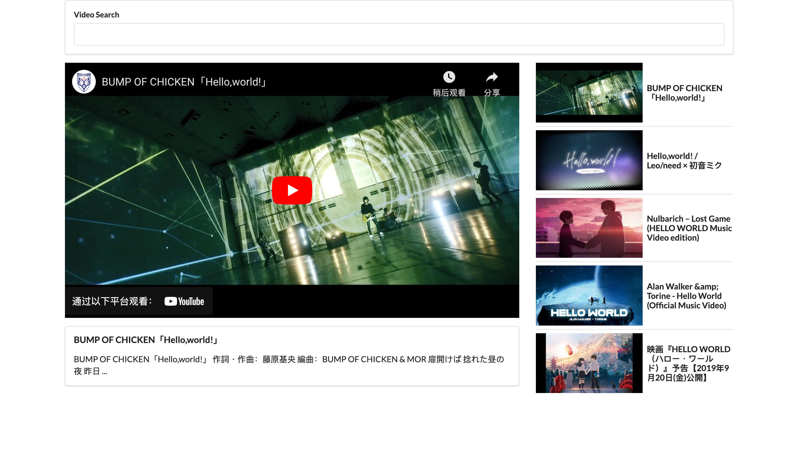

# Simple Youtube Searcher

This project builds a [Simple Youtube Searcher](https://videos-johnzhu04.vercel.app/) using React and Semantic UI.

## Usage

Prerequisite: First you need to set your own [youtube API key](src/apis/youtube.js).

### `npm start`

Runs the app in the development mode. \
Open [http://localhost:3000](http://localhost:3000) to view it in your browser.

The page will reload when you make changes.\
You may also see any lint errors in the console.
